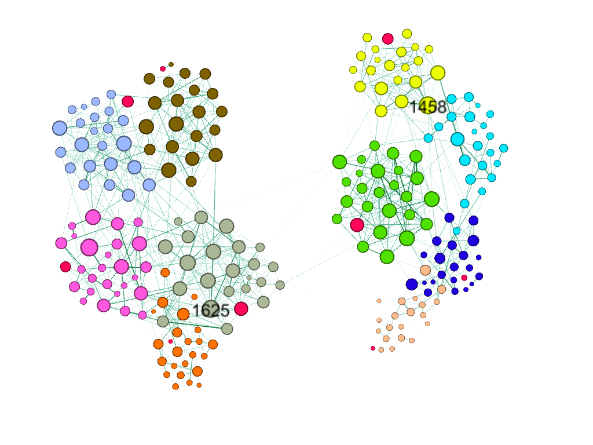

```{r global_options, include = FALSE}
library(knitr)
setwd("~/Github Project R/InteractPattern")
read_chunk("proj_data.R")
knitr::opts_chunk$set(echo = FALSE,warning = FALSE,message = FALSE, fig.align="center")
```
##  Introduction

Human interactions and human behaviors has been a fascinating and challenging subject of study in recent times. Social network companies, consumer markets, medical industries have been trying to study human behavior to predict the consumer needs, recommend goods, optimize marketing strategies, or in case of medical industry diagnose and study disease patterns. Child psychology and child interaction behavior is very different from an adult behavior. Study of children interaction pattern is very important to understand and improve the development of children. These studies have been used to understand the development in children as well as spreading of highly communicable disease like influenza, hepatitis and measles. Children are prone to these diseases and the pattern study of interaction of children helps to find the propagation and evaluation of the control measures of these diseases. Through this study, we want to find how age, gender, grade affect the interaction pattern in children.

## Data

Data for this project was obtained from the Socio patterns website (sociopatterns.org). The dataset had two networks, one for each day, of face-to-face interaction between students and teachers. These interactions were collected from a French school in 2009 using radio frequency identification devices that recognizes an interaction by proximity sensors. The students involved in the data are ages 6 to 12 attending grades 1 to 5. There were 232 children and 10 teachers who were involved in 77,602 contacts amongst each other in course of two days. There were 10 classes, grades 1 to 5 with section A and B, and in each grade, there were around 25 students. In average, each child had around 165 interactions and spent an average of 176 minutes in interaction per day. The gender and grade were provided for the children and also the count and duration of interactions were provided. For a contact to occur between two individuals, they must be in certain proximity for at least 20 seconds. A packet of information is sent after every 20 second. A contact is broken once they are further than the defined proximity and if they come in contact again new contact is added and time is added to previous duration.

## Analysis

Analysis for this project was focused on finding patterns of interaction by grades and gender to study if the students show homophile behavior. Do children of opposite sex interact as much as same sex? Which grades/age children are more social? How popular are the most popular student? In following analysis we will be trying to answer these quesitons.


### Data Exploration

The files from the data source website were in GEXF gephi format, one file for each day. I loaded the files in gephi and explored different layouts to visualize the network data. 


<center><em>Degree Distribution for Day 1</em></center>
<br><br>

<center><em>Degree Distribution for Day 2</em></center>
<br>
Using the gephi community detection, there were 8 communities detected for both days with modularity of 0.75. The algorithm performs well on separating communities by grades. Same grade students form a community. This measure shows how well the network can decomposed into modular communities. Grades 2A and 2B are in same community, grade 5A and grade 5B are in same communities while Grades 1A and 1B, 3A and 3B, and 4A and 4B form separate communities. This also shows sign of homophile behavior since there is high interaction between same grade students which resulted in same grade students being in same community.


<center><em>Communities detected by Gephi Modularity Algorithm</em></center>

<br>
```{r C1}
```

```{r C2}
```

```{r C3}
```


```{r C4}
```
```{r C5}
```
<br>
```{r C6}
```
<center><em>Degree Distribution by Grade</em></center>
<br>
```{r C6.1}
```
<center><em>Degree Distribution by Gender</em></center>
<br>

<br>
<br>
<em>Over the course of two days, grade 1B had the most interactions. Comparing to the other section, the same grade (1A) students had half the number of contacts. Teachers seem to have the least contacts and among the classes grade 4B had the lowest number of contacts.</em>
<br><br>
```{r C7}
```
<center><em>Heatmap of interactions by Grade</em></center>

```{r C8}
```
<br>

```{r C9}
```
<br>
The average weighted degree was 10 and maximum was 23. This means in average a student interacted with 10 individual and the student who had the most interactions connected with 23 other students in the given day.

In the histogram, we see the distribution of weighted degree by gender. For both male and female students, the histogram looks normally distributed with most students towards the middle of the chart. We can say, the chart is a bit skewed to the right since there are few students with high degree.

When comparing boys versus girls, looks like boys are more interactive. Girls have degree 10 as the highest count which means degree 10 is the most common amongst the girls. Whereas for boys degree 14 is the most common degree. Also the person with highest degree(23) is a boy.
<br><br>

<center><em>Weighted degree by Grade</em></center>
<br>

In the above graph, the nodes are sized by weighted degree and the label size by node size. The color of the nodes are partitioned by the grades. There are grades 1 to 5 with 2 sections for each grade. Teacher nodes are colored red. 

In this network, students in same grade are grouped together because they are more likely to form their own committee with most interaction happening with students in same grade. Grade 1B clearly pop out with most students in the class with higher weighted degree. Grade 1B students are highly interactive with larger nodes. Furthermore,grades 2B, 4A and 3B have one student each with relatively big nodes. These individual students are likely to be the most social student in those classes. In contrast, grades 4B and 2A don’t seem to have high degree nodes. Few dark edges are visible explaning they might have had interaction between fewer students but those interactions were significant ( longer or multiple interaction between same students).

Interestingly, teacher do not show high weighted degree. One teacher in the middle of 1B student nodes look to be more interactive than others.
<br>
<br>

<center><em>Centrality Measure correlations</em></center>
<br>

There is a strong correlation between degree and pagerank. This means important nodes are high degree nodes. Another interesting insight is betweenness centrality and degree centrality are not strongly correlated. This means high degree nodes are not the connections for most  interactions. This proves that the most interactive student may not be the fastest connection between two students.

In addition, there seem to be no correlation between eigenvector and betweenness centrality. With means most influencing students in this network are not the in-between connections for most interaction. There are many students and many interactions happening so even the most influencing students would not necessarily be the connections for other students interactions.
<br>
<br>

<center><em>Eigenvector Centrality</em></center>
<br>
To look at the most influencing node we check the eigenvector centrality measure. High degree nodes do not necessarily the most important nodes. It uses adjacency matrix of the graph to calculate the eigenvalues.

The nodes and label size is sized by the eigenvector centrality measure. We again see nodes from grade 1B with high eigenvector centrality. They are the most influencing nodes in the network.
<br>
<br>

<center><em>Highest Weighted Degree nodes</em></center>
<br>
The graph above shows the top three highest degree nodes. These are nodes 1697, 1890 and 1688. They are from Grades 1B and 2B. They have weighted degree of 23 and 22. The color of the nodes are based on the male and female gender and the red node is the highest degree node.

The students from smaller grades have higher degree interaction and are more influencing. As the kids get older they seem to have smaller friend circle and less interactions between them.


### Network properties
```{r C10}
```
### Degree Boxplot by Grade 
```{r C11}
```
### Giant Components
```{r C12}
```
### Centrality Measures Corr Plot
```{r C13}
```
### Betweeness and Closeness Distributon
```{r C14}
```
### ERGM Models
```{r C15}
```

### Model 1 for Day 1
simple model
no mcmc stored
```{r C16}
```
### Model 2
added Age difference and MCMC burnin

```{r C17}
```
### Model 3
added Degree 1
```{r C18}
```
### Model 4
updated degree(2:4) based on GOF from Model 3 and added gwesp
```{r C19}
```
### Model 6
added Degree 9, nodematch for Grade and increased burnin computation
This is much better model.
MCMC statistics show some autocorrelation but the joint pvalue is better.
```{r C21}
```

### Model 1 for Day 2
Simple model to begin with
```{r C22}
```
### Model 2 and 3

added age difference and nodemix for gender
```{r C23}
```

### Model 4
added Nodematch for Grade and Degrees based on GOF and also increased computational power
```{r C24}
```
### Model 5
AIC and BIC are still not looking good. P-values are not significant. GOF is not performing well
```{r C25}
```
### Model 6
MCMC statistics have high correlations, and joint p-value is also 0.
```{r C26}
```
### Model 7
Still the model does not perform well with updated degree
```{r C27}
```
### CUG test 
High Assortativity on both Grade and Gender attributes.
The Grade has higher assortativity so the assortativity is higher than random generated graphs.
```{r C28}
```
### QAP test
Assortativity test passes for QAP test also. High Assotativity for Grade than Gender. The nodes were not randomly assortative.
```{r C29}
```

### Conditional Probability For Grade Match, Male-Male, Female-Female, Male-Female Edges forming
Highest probability for Same grade nodes to form an edge
```{r C30}
```